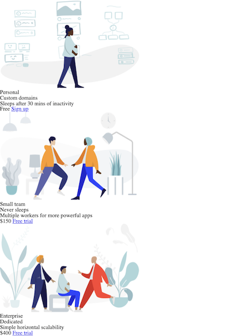

# Responsive Price Panel

The price panel is responsive on desktop and mobile screens. At a desktop view, it’s centered horizontally in a column format; when it’s resized down to a mobile screen, the panel will adapt to a smaller viewport and appear vertically with a row layout.

## 🎉 Demo 

## ✨ Motivation 

Coded from scratch on the CSS file to reinforce my CSS and Flexbox knowledge and practice building a responsive website with media query. The project starter looks like this:

## 👏 Credits

This project is based on the Flexbox tutorial on Udemy by <a href="https://www.udemy.com/user/coltsteele/">Colt Steele</a>. 

The design is inspired by a CodePen by <a href="https://codepen.io/travisw">Travis Williamson</a>.

